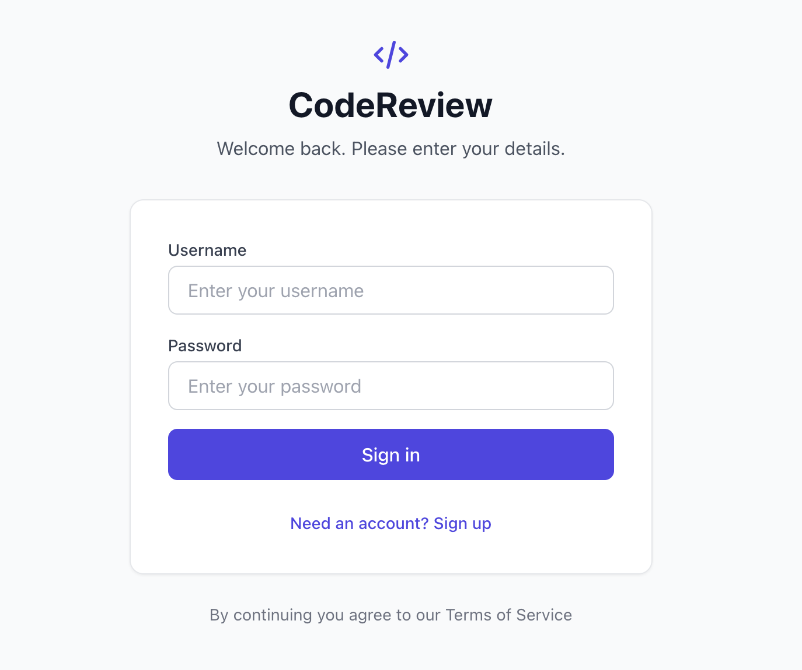
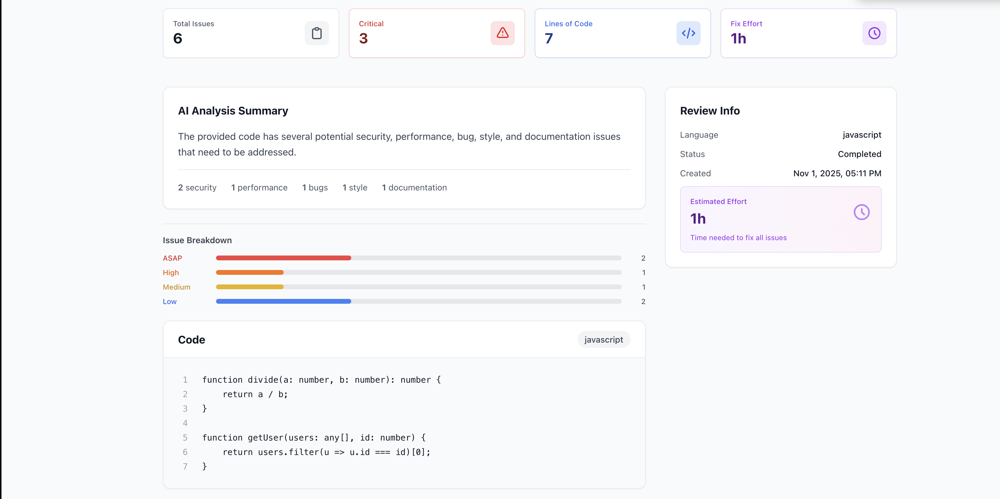
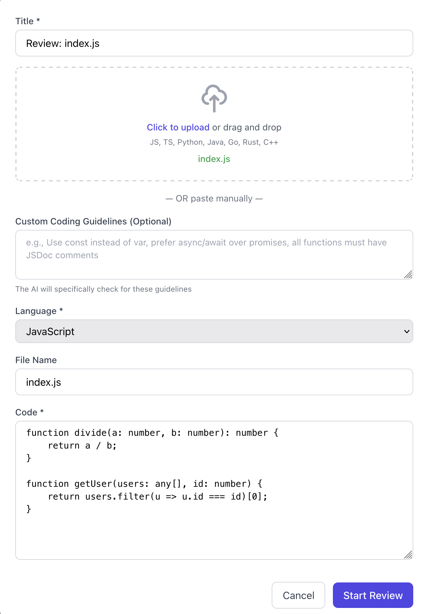
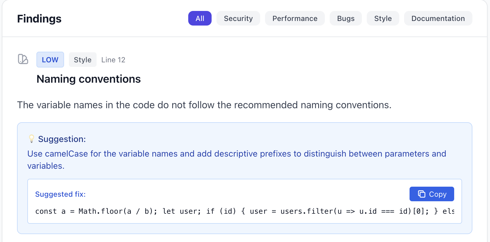

# CodeReview - AI-Powered **Code Review Assistant**

> An intelligent code review platform that leverages local LLMs to analyze code quality, security, and performance issues in real-time.

Built in ~8 hours for the Haufe 2025 Hackathon.

---

## Features

- **Local LLM Integration** - Powered by Ollama (CodeLlama 7B) for privacy-first code analysis
- **Smart Issue Detection** - Automatically identifies security, performance, bugs, style, and documentation issues
- **Custom Coding Guidelines** - Add team-specific rules and conventions
- **AI-Powered Suggestions** - Get actionable fix recommendations with code examples
- **Effort Estimation** - Automatic calculation of time needed to address findings(based on LLM's view)
- **Multi-Language Support** - JavaScript, TypeScript, Python, Java, Go, Rust, C++
- **Drag-and-Drop Upload** - Easy file submission with automatic language detection
- **Clean, Minimalist UI** - Built with Angular + Tailwind CSS

---

## Screenshots

### Login

*Auth interface with user-friendly design*

### Dashboard

*Overview of code reviews with AI analysis summary, issue breakdown, and effort estimation*

### Create Review

*Submit code via drag-and-drop or paste, with custom coding guidelines support*

### Findings

*Detailed findings categorized by severity with suggestions and code fixes*

---

## Tech Stack

**Backend:**
- NestJS
- Prisma ORM
- SQLite Database
- Ollama (Local LLM)
- JWT Authentication

**Frontend:**
- Angular
- TypeScript
- Tailwind CSS
- RxJS

---

## Quick Start

### Prerequisites
- Node.js 18+
- Ollama installed with CodeLlama model

### Installation

# Install Ollama model
ollama pull codellama:7b

# Backend setup
- `cd backend`
- `npm install`
- `npx prisma generate`
- `npx prisma db push`
- `npm run start:dev`

# Frontend setup
- `cd frontend` 
- `npm install`
- `ng serve`

---

## How It Works

1. **Upload Code** - Paste or drag-and-drop your code file
2. **Set Guidelines** (Optional) - Add custom coding rules to enforce
3. **AI Analysis** - Local LLM analyzes the code 
4. **Review Findings** - Get categorized issues by severity
5. **Apply Fixes** - Copy suggested code improvements with one click

---

## Hackathon Achievements

- Local LLM integration (Ollama)  
- Custom coding guidelines enforcement  
- Effort estimation system  
- Clean, intuitive UI/UX  
- File upload with auto-detection  
- Real-time code analysis  
- Severity-based filtering  

---

## 👨‍💻 Author

Built with ☕ during Haufe 2025 Hackathon
